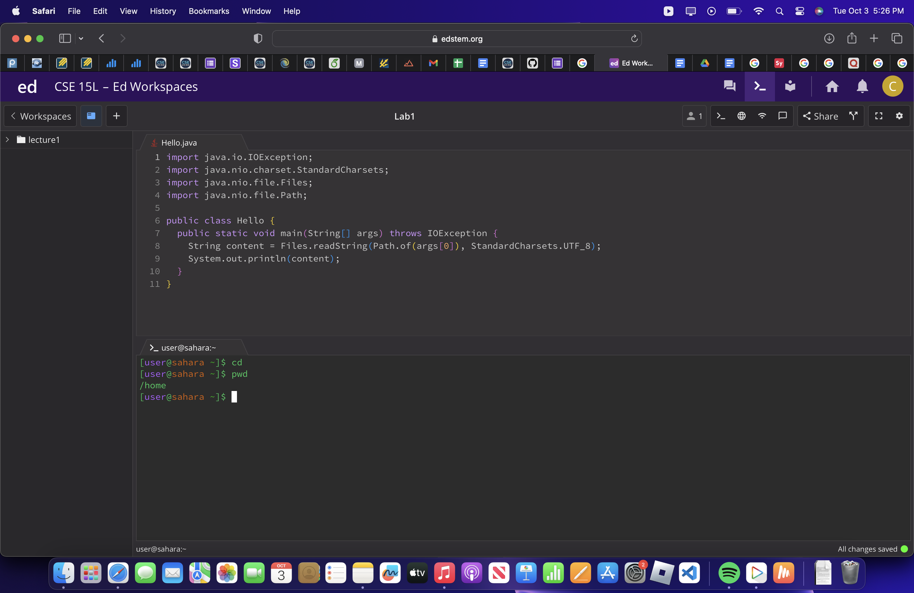

cd

1. The working directory was /home when the command was run. Since that was the case the output was given as the previous/current working directory since no arguments were given to change it. This is not an error because the directory wasn't instructed to change to a given directory.

2. The working directory was /home when the command was run. Since a directory argument was given the new current working directory has been changed to that argument. This is not an error because the directory successfully changed to the given argument.

3. The working directory was /home/lecture1 when the command was run. Since a file argument was given the current working directory remains the same. This is an error because the directory can't change to a file.

ls

1. The working directory was /home when the command was run. Since no arguments were given it displayed the name of the file under the current working directory just being lecture1. This is not an error because lecture1 is the only folder in /home to list.

3. The working directory was /home when the command was run. Since the lecture1 directory argument was given it listed the files under it. This is not an error because it successfully listed the files under the given argument.

3. The working directory was /home/lecture1 when the command was run. Since the messages/en-us.txt file argument was given it only listed that file. This is not an error because there are no other files under the given argument.

cat

1. The working directory was /home when the command was run. Since no arguments were given the terminal waits for an input. This is an error because it fails to concatenate anything and allow for no arguments.

2. The working directory was /home when the command was run. Since a directory argument was given it doesn't print anything. This is an error because it couldn't concatenate a directory's files directly.

3. The working directory was /home when the command was run. Since a file argument was given it printed the text within that file. This is not an error because it successfully printed that file's text.
